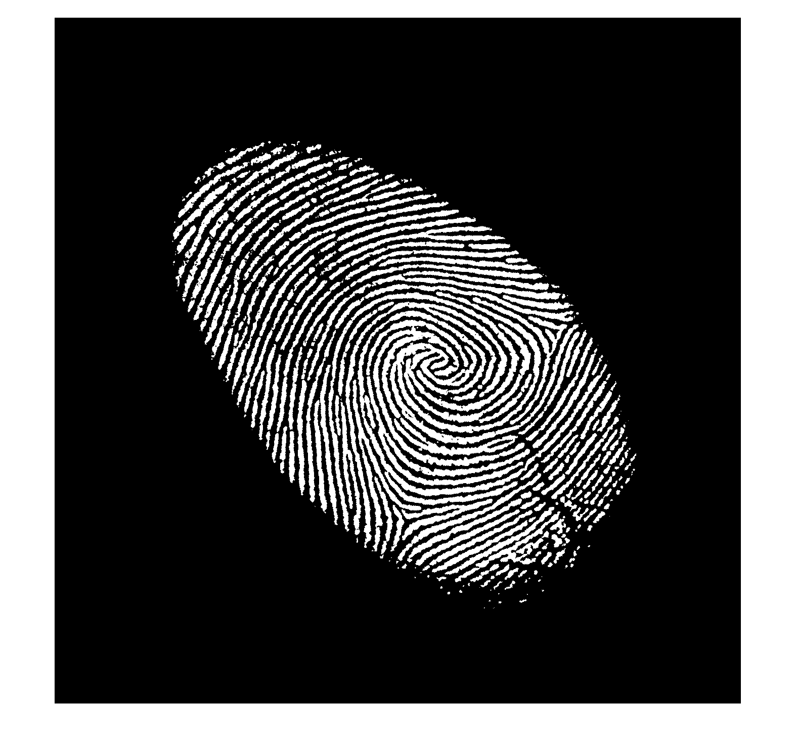
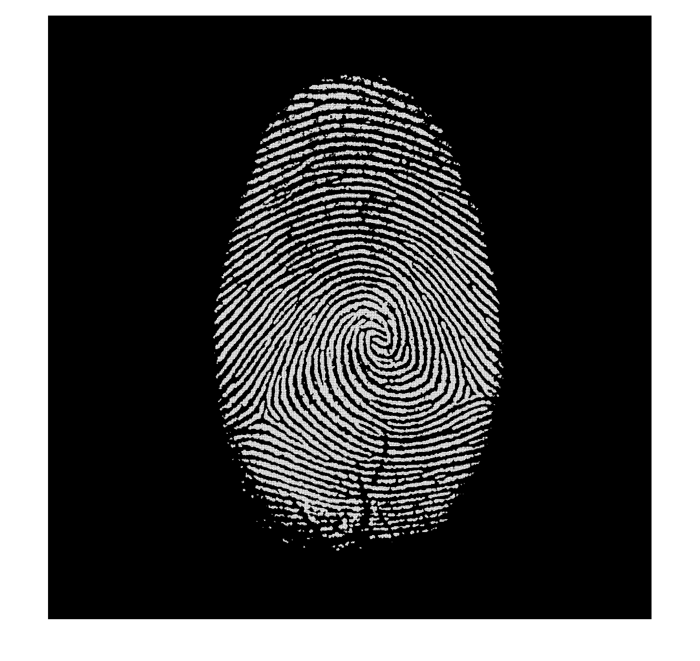

# PCA for Biomedical Image Analysis
Fingerprint Orientation Normalization Using PCA

Ever wondered why your phone doesn’t ask you to place your thumb **perfectly straight** on the fingerprint sensor?

This is because many biometric systems use **Principal Component Analysis (PCA)** to automatically correct the orientation of fingerprints (and other similar biomedical images) before matching. This project demonstrates exactly how that works.

This technique is part of **biomedical image analysis**, where orientation normalization helps improve consistency, pattern matching, and recognition accuracy — especially in tasks like fingerprint authentication.

*Figure 1: Original fingerprint input (tilted)*

*Figure 2: Orientation corrected using PCA*

## 🏃 How to Run

1. Download or clone this repository.
2. Make sure the following files are in the same directory:
   - `main.m`
   - `P3.mat`
   - All helper functions (e.g., `non_zeros_pixels.m`, `cov_eig_calculate.m`, etc.)
3. Open MATLAB and run:

## Applications
Biometric authentication systems

Medical imaging (e.g., histology slides, retina scans)

Preprocessing for deep learning

Object alignment and normalization tasks
